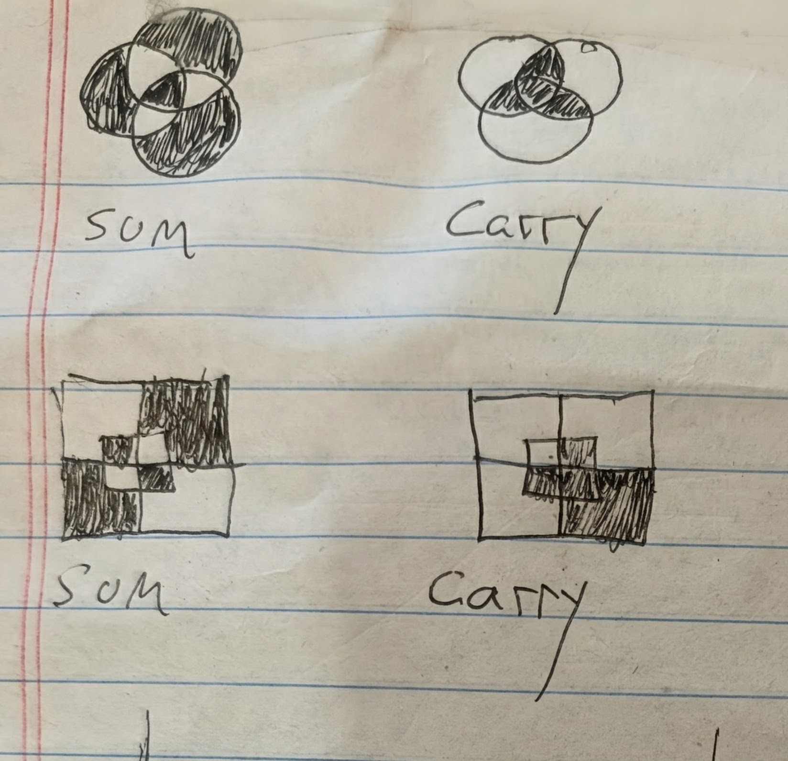

# Sixteen Functions, Two Ways

There are exactly sixteen boolean functions of two variables. This asks two
questions about them at once.

**Symbolically** — compose them into deep expression trees and find which
compositions are tautologies. 2²⁸ expressions filter down to 32 irreducible
ones, rendered as English.

**Geometrically** — a 2–3–1 network's hidden→output weights are three numbers,
so every set of weights that computes a given function is a *point in 3D*.
Collect enough and each function has a visible solution region.

**[Read it and explore →](https://gernreich.github.io/weight-space-shells/)**

- **[Weight Space Shells](https://gernreich.github.io/weight-space-shells/shells.html)**
  — all sixteen functions as rotatable clouds, generated vs. the 2019 archive
- **[Sixteen Cones](https://gernreich.github.io/weight-space-shells/cones.html)**
  — the same regions from a cube, a ball, and as pure directions

## The sixteen functions in lambda calculus

[`lambda16.txt`](lambda16.txt) writes all sixteen functions as lambda terms and
reduces each one on all four inputs. These pages build on it. They are private
claude.ai pages until shared from each page's Share menu.

- **[Learn lambda calculus](https://claude.ai/artifact/BZnTt47kC1gdDDSKhiPW6k)**
  — an 11-module course, from the three building blocks to logic, pairs,
  numbers and recursion
- **[Tromp diagrams, step by step](https://claude.ai/artifact/QBamJgp2UNdF67VgMUjzDP)**
  — lessons with diagrams in colour and monochrome, plus exercises
- **[Tromp diagrams in motion](https://claude.ai/artifact/TykF7U7y4S2qATkRcVSTfL)**
  — animated β-reduction, with pause and resume
- **[Gates of gates](https://claude.ai/artifact/BSo6NyozfuMkctwmoWpVun)**
  — all sixteen gates applied to every pair of gates, and the 506 programs
  behind them (a local copy is in [`gates-of-gates/`](gates-of-gates/))
- **[Tromp diagrams](https://claude.ai/artifact/AbcZbeWun1jcnWLe37Da2r)**
  — the first diagram page: TRUE, FALSE, the P gate on all four inputs
- **[The FALSE gate on all four inputs](https://claude.ai/artifact/FzoiyF2jNJVFbTopoWmzM6)**
  — a colour-coded text reduction

## Layout

    python/          enumeration and tautology filtering
    ANN/             weight-space search and the point clouds
    docs/            the viewer (GitHub Pages serves from here)
    gates-of-gates/  all 16 gates applied to every pair of gates (the 1995 poster, recomputed)
    lambda16.txt     the sixteen functions as lambda terms, with every β-reduction

Both halves have their own README with file-by-file detail. Original 2019
scripts are preserved untouched in each `original_2019/`.

## Quick start

    python3 python/test_boolean16.py          # 18 checks
    python3 ANN/test_nncore.py                # 29 checks

    # measure how hard each function is to hit
    python3 ANN/generate_clouds.py --samples 4000000 --range 20 --rates

    # regenerate the clouds the viewer uses (~46s)
    python3 ANN/generate_clouds.py --samples 200000000 --range 20 --n 0.9 \
        --seed 1 --cap 12000 --out ANN/generated_clouds

    # ball-sampled and direction-only (used by the Cones viewer)
    python3 ANN/generate_clouds.py --samples 120000000 --range 20 --n 0.9 \
        --seed 2 --shape ball --cap 11000 --out ANN/clouds_ball
    python3 ANN/generate_clouds.py --samples 120000000 --range 20 --n 0.9 \
        --seed 3 --shape ball --normalise --cap 11000 --out ANN/clouds_dir

## What this is and isn't

The useful parts are empirical and pedagogical, not novel.

**Worth having.** Random search makes function difficulty *measurable*.
Sampling uniformly from ±20:

| function | hit rate |
|---|---|
| `TRUE` / `FALSE` | 2.0 × 10⁻¹ |
| `IMPLICATION` and kin | 1.3 × 10⁻² |
| `P`, `Q`, `NOT P`, `NOT Q` | ~1.0 × 10⁻² |
| `AND`, `NAND` | 1.6 × 10⁻³ |
| `XOR`, `XNOR` | 4.4 × 10⁻⁵ |

Below about ±15, `XOR` is not merely rare — it is **absent**: zero hits in four
million samples at ±10.

The deeper reason: **each solution set is a cone.** If a weight vector works, so
does every positive multiple of it — verified on 400 accepted sets across five
scale factors, 2,000 checks, zero failures. The set is unbounded, so whatever
region you sample from draws the cloud's outer surface; a cube gives flat faces,
a ball gives a round hull, and neither is real. Only the directions are
intrinsic, and on the unit sphere:

| function | sphere covered |
|---|---|
| `TRUE` / `FALSE` | 47.2% |
| `IMPLICATION` and kin | 35.0% |
| `P`, `Q`, `NOT P`, `NOT Q` | 34.8% |
| `AND` / `NAND` | 28.4% |
| `XOR` / `XNOR` | **4.8%** |

`XOR` is hard because only 4.8% of directions work for it.

**Not novel.** Complementary functions have mirror-image solution regions
because `sigmoid(−x) = 1 − sigmoid(x)`; that is one line of algebra, not a
discovery. That `XOR` needs a hidden layer has been known since Minsky and
Papert (1969).

## Sum and carry, drawn three ways

Hand drawings of a full adder's two outputs, each a function of three inputs:
**sum** is TRUE when an odd number of inputs are TRUE, and **carry** is TRUE when
at least two are. Each is drawn as a three-set Venn diagram in three styles:
round circles, a square Venn (the same encoding as the 1995 poster in
[`gates-of-gates/`](gates-of-gates/)), and curves built from sine waves.

| Circles and square Venns | Adding the sine-wave Venns | Sine Venn, three sets |
|---|---|---|
|  |  |  |
| `sum-carry-venn.jpg` | `sum-carry-venn-sine.jpg` | `sum-carry-Sine.jpg` |

## Notes on the 2019 data

The archived clouds are kept because they are **not** reproducible — the exact
parameters of those runs were never recorded. Generated data is gitignored.

Some archived filenames do not describe their contents. Verified by running the
forward pass rather than trusting names:

| output | filename | actually is |
|---|---|---|
| `(1,0,0,0)` | `R9NAND__*` | **NOR** |
| `(1,0,1,1)` | `R9IMPLICATION__*` | **Q → P**, the converse |
| `(1,1,0,1)` | `R9REVIMPLICATION__*` | **P → Q**, implication |

Real `NAND` was never searched for in those scripts. The errors are not
uniform — the `262k` folder's names are correct, from a later fix.

Two scripts have never run: `ANN/original_2019/train_random_weight_search_v4.py`
(`TypeError`, string arithmetic on `sys.argv`) and
`ANN/four_to_sixteen_architecture/working.py` (`IndentationError`, plus Python-2
`xrange`).

## Publishing the viewer

`docs/` holds three self-contained pages — an explanation at `index.html` and
the two viewers — with all data inlined, no build step, and no external requests
beyond Google Fonts. Pages serves from **main / docs**.
