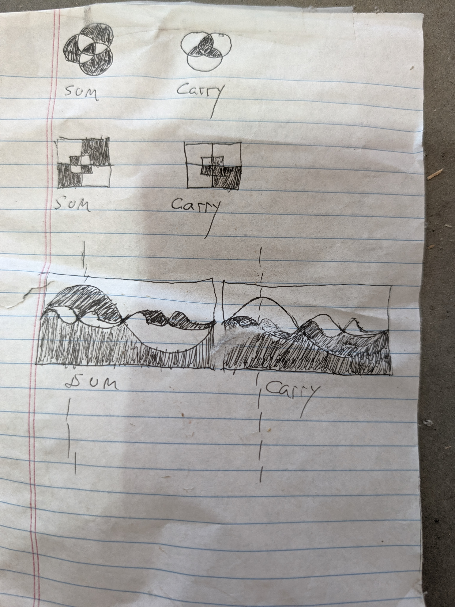
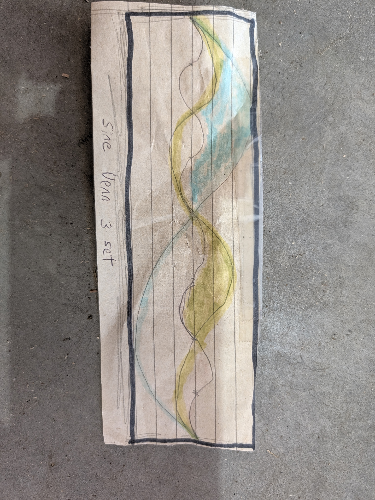

# Sixteen Functions, Three Ways

There are exactly sixteen boolean functions of two variables. This asks three
questions about them at once.

**Symbolically** — compose them into deep expression trees and find which
compositions are tautologies. Of 2²⁸ expressions, the tautologies built from
the eight two-input operations filter down to 32 irreducible ones, rendered as
English. The search for a new rule like modus ponens came back empty:
[`python/inference-search.md`](python/inference-search.md).

**Geometrically** — a 2–3–1 network's hidden→output weights are three numbers,
so every set of weights that computes a given function is a *point in 3D*.
Collect enough and each function has a visible solution region.

**By lambda reduction** — apply every function to every pair of functions,
recomputing a hand-made 1995 poster. The 4,096 cells are lambda terms that
reduce to 506 distinct programs, each behaving like one of the sixteen.

**[Read it and explore →](https://gernreich.github.io/Logic-Research/)**

- **[Weight Space Shells](https://gernreich.github.io/Logic-Research/shells.html)**
  — all sixteen functions as rotatable clouds, generated vs. the 2019 archive
- **[Sixteen Cones](https://gernreich.github.io/Logic-Research/cones.html)**
  — the same regions from a cube, a ball, and as pure directions
- **[Gates of Gates](https://gernreich.github.io/Logic-Research/gates-of-gates.html)**
  — every function applied to every pair of functions, 4,096 cells
- **[The 506 Programs](https://gernreich.github.io/Logic-Research/programs-506.html)**
  — the distinct lambda terms behind those cells, in eight notations
- **[Modus Ponens in Sixteen Values](https://gernreich.github.io/Logic-Research/modus-ponens-16.html)**
  — from P and P→Q when both are sixteen-valued
- **[Modus Ponens from P∨Q](https://gernreich.github.io/Logic-Research/modus-ponens-or.html)**
  — the weaker premise P∨Q gives back exactly Q
- **[Gates of Gates, the document](https://gernreich.github.io/Logic-Research/gates-of-gates-document.html)**
  — all of it in one self-contained file (13 MB)
- **[The 1995 poster](https://gernreich.github.io/Logic-Research/poster-1995.jpg)**
  — the hand-made gates-of-gates poster that started it

## The sixteen functions in lambda calculus

[`lambda16.txt`](https://gernreich.github.io/Logic-Research/lambda16.txt) writes all sixteen functions as lambda terms and
reduces each one on all four inputs. [`gates-of-gates/`](gates-of-gates/)
applies every function to every pair of functions, 4,096 cells, computed from
those terms; its [interactive version](https://gernreich.github.io/Logic-Research/gates-of-gates.html)
is on the public site.

## Layout

    python/          enumeration and tautology filtering
    ANN/             weight-space search and the point clouds
    docs/            the viewer (GitHub Pages serves from here)
    gates-of-gates/  all 16 gates applied to every pair of gates (the 1995 poster, recomputed)
    sum-carry/       hand drawings of a full adder's sum and carry as Venn diagrams
    lambda16.txt     the sixteen functions as lambda terms, with every β-reduction

`python/`, `ANN/` and `gates-of-gates/` each have their own README with
file-by-file detail. Original 2019
scripts are preserved untouched in each `original_2019/`.

## Quick start

    python3 python/test_boolean16.py          # 17 checks
    python3 ANN/test_nncore.py                # 30 checks

    # measure how hard each function is to hit
    python3 ANN/generate_clouds.py --samples 4000000 --range 20 --rates

    # regenerate the clouds the viewer uses (~46s)
    python3 ANN/generate_clouds.py --samples 200000000 --range 20 --n 0.9 \
        --seed 1 --cap 12000 --out ANN/generated_clouds

    # ball-sampled and direction-only (used by the Cones viewer)
    python3 ANN/generate_clouds.py --samples 120000000 --range 20 --n 0.9 \
        --seed 2 --shape ball --cap 11000 --out ANN/clouds_ball
    python3 ANN/generate_clouds.py --samples 120000000 --range 20 --n 0.9 \
        --seed 3 --shape ball --normalise --cap 11000 --out ANN/clouds_dir

    # rebuild docs/shells.html and docs/cones.html from those three folders
    python3 ANN/build_viewers.py

## What this is and isn't

The useful parts are empirical and pedagogical, not novel.

**Worth having.** Random search makes function difficulty *measurable*.
Sampling uniformly from ±20:

| function | hit rate |
|---|---|
| `TRUE` / `FALSE` | 2.0 × 10⁻¹ |
| `IMPLICATION` and kin | 1.3 × 10⁻² |
| `OR` / `NOR` | 1.1 × 10⁻² |
| `P`, `Q`, `NOT P`, `NOT Q` | ~1.0 × 10⁻² |
| `AND`, `NAND` | 1.6 × 10⁻³ |
| `XOR`, `XNOR` | 4.4 × 10⁻⁵ |

At ±10, `XOR` all but vanishes: 10 hits in 400 million samples (2.5 × 10⁻⁸),
more than a thousand times rarer than at ±20. The 2019 ±10 runs in
`Sixteen/tempp/toot/` did find some.

The deeper reason: **each solution set is a cone.** If a weight vector works, so
does every larger multiple of it — verified on 400 accepted sets across five
scale factors, 2,000 checks, zero failures. The set is unbounded, so whatever
region you sample from draws the cloud's outer surface; a cube gives flat faces,
a ball gives a round hull, and neither is real. Only the directions are
intrinsic, and on the unit sphere:

| function | sphere covered |
|---|---|
| `TRUE` / `FALSE` | 47.2% |
| `IMPLICATION` and kin | 35.0% |
| `P`, `Q`, `NOT P`, `NOT Q` | 34.8% |
| `OR` / `NOR` | 34.1% |
| `AND` / `NAND` | 28.4% |
| `XOR` / `XNOR` | **4.8%** |

`XOR` is hard because only 4.8% of directions work for it.

**Not novel.** Complementary functions have mirror-image solution regions
because `sigmoid(−x) = 1 − sigmoid(x)`; that is one line of algebra, not a
discovery. That `XOR` needs a hidden layer has been known since Minsky and
Papert (1969).

## Sum and carry, drawn three ways

Hand drawings of a full adder's two outputs, each a function of three inputs:
**sum** is TRUE when an odd number of inputs are TRUE, and **carry** is TRUE when
at least two are. Each is drawn as a three-set Venn diagram in three styles:
round circles, a square Venn (the same encoding as the 1995 poster in
[`gates-of-gates/`](gates-of-gates/)), and curves built from sine waves.

| Circles and square Venns | Adding the sine-wave Venns | Sine Venn, three sets |
|---|---|---|
|  |  |  |
| `sum-carry/sum-carry-venn.jpg` | `sum-carry/sum-carry-venn-sine.jpg` | `sum-carry/sum-carry-Sine.jpg` |

## Notes on the 2019 data

The archived clouds are kept because they are **not** reproducible — the exact
parameters of those runs were never recorded. Generated data is gitignored.

Some archived filenames do not describe their contents. Verified by running the
forward pass rather than trusting names:

| output | filename | actually is |
|---|---|---|
| `(1,0,0,0)` | `R9NAND__*` | **NOR** |
| `(1,0,1,1)` | `R9IMPLICATION__*` | **Q → P**, the converse |
| `(1,1,0,1)` | `R9REVIMPLICATION__*` | **P → Q**, implication |

Real `NAND` was never searched for in those scripts; later runs found it. The
errors are not uniform: in the `262k` folder, `R9NAND` holds real `NAND`, but
`R9IMPLICATION` still holds the converse, like the older files.

Two scripts have never run: `ANN/original_2019/train_random_weight_search_v4.py`
(`TypeError`, string arithmetic on `sys.argv`) and
`ANN/four_to_sixteen_architecture/working.py` (`IndentationError`, plus Python-2
`xrange`).

## Publishing the viewer

`docs/` holds eight self-contained pages — an explanation at `index.html`, the
Shells and Cones viewers, the Gates of Gates and 506 Programs pages, the
Gates of Gates document, and the two modus ponens pages — plus `lambda16.txt`
and the poster photo. All data is
inlined, with no external requests beyond Google Fonts. Pages serves from
**main / docs**. The three gates-of-gates pages, `lambda16.txt` and the poster
photo are put there by the recipe in
[`gates-of-gates/README.md`](gates-of-gates/README.md); the modus ponens pages
are copies of the ones in `python/`.

## Licence

Released under [CC0 1.0](LICENSE). **The 2019 networks start from Andrew
Trask's [A Neural Network in 11 lines of
Python](https://iamtrask.github.io/2015/07/12/basic-python-network/)** —
`ANN/iamtrask_boolean_function_runs/Sixteen/tempp/elevenlines.py` is his code as
published, and CC0 covers only what is original here.
