# Gates of gates: 16 × 16 × 16

Every one of the 16 two-input logic gates, applied to every pair of gates.

For each gate **G** there is a 16 × 16 square. G sits at the origin in the top-left corner, the gates run left to right as the first input **X** and top to bottom as the second input **Y**, and each cell is **G(X, Y)**: G applied row by row to the truth tables of X and Y. The result is always one of the same 16 gates. In lambda calculus a cell is the term

```
λp.λq.λa.λb. G (X p q) (Y p q) a b
```

with the three gates' terms from [`lambda16.txt`](../lambda16.txt) plugged in. That makes 16 × 16 × 16 = **4,096 cells**.

Everything here is also in one self-contained file, [`gates-of-gates.html`](gates-of-gates.html): this write-up with its images, both interactive pages, `lambda16.txt` and the data, with nothing loaded from the internet.

Gates are numbered 0–15 in the [`boolean16.py`](../python/boolean16.py) order, where gate i and gate 15 − i are complements. Truth tables are written TT TF FT FF, for (p, q) = (T,T), (T,F), (F,T), (F,F).

## The 1995 poster

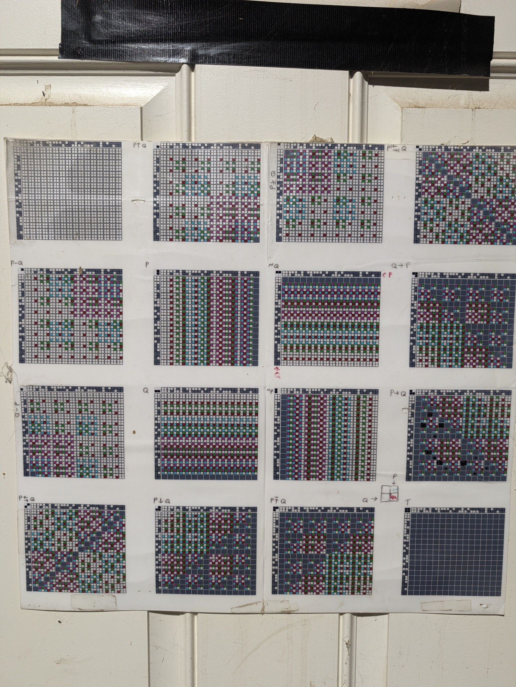

The same idea, drawn by hand in 1995: sixteen 16 × 16 squares in a 4 × 4 layout, F in the top-left corner and T in the bottom-right. Every gate, including the input gates along the top and left edges, is drawn as a **square Venn diagram** on graph paper. Each colour marks a **position in the square Venn**, one region of the truth table, and the Venn served as both logic and data. P and ~P show vertical stripes, Q and ~Q horizontal stripes, and the complement pairs sit in mirrored positions (P and ~P are squares 5 and 10, Q and ~Q are 9 and 6, F and T are 0 and 15, each pair adding to 15).

The poster took some liberties and probably contains mistakes, so treat it with a grain of salt. The recomputation below is checked cell by cell. Two details are still open:
- **Grey:** on the poster the T square is solid grey. It may be that grey meant "every region TRUE".
- **Which colour was which region:** the mapping used in the recomputation (magenta, cyan, green, dark red for p and q, p only, q only, neither) is a guess.

## The recomputation (2026)

Every cell was computed by **lambda reduction** (16,384 reductions: 4,096 cells × 4 inputs), using the gate terms read from `lambda16.txt`, and each result was **cross-checked against plain bitwise arithmetic** on the truth tables. All 4,096 agree. Each gate's own truth table was also re-derived by reduction and matched the file.

**Interactive version:** [Gates of gates](https://claude.ai/artifact/BSo6NyozfuMkctwmoWpVun) (a private claude.ai page; share it from its Share menu to let others open it). A local copy is in [`page/gates-of-gates.html`](page/gates-of-gates.html). It has six cell views (truth table, Venn colours, square Venn, gate number, same term, one quarter), two axis orders, hover details, and a full table for any square.

### Square Venn view, 1995 style

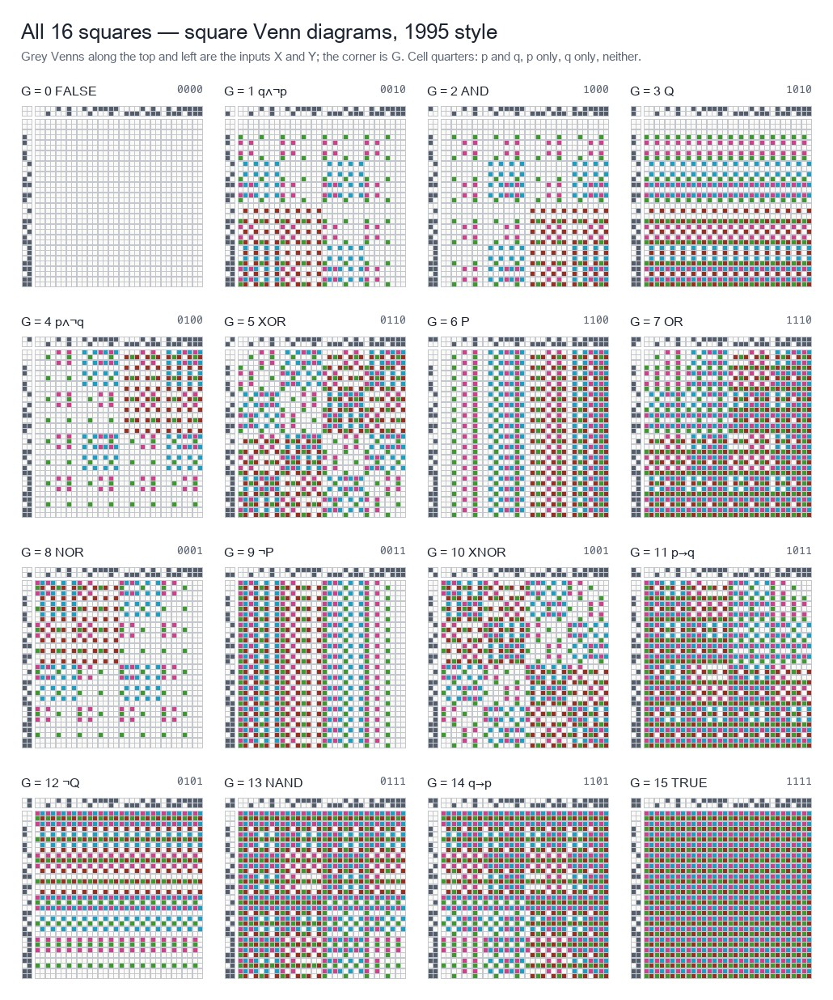

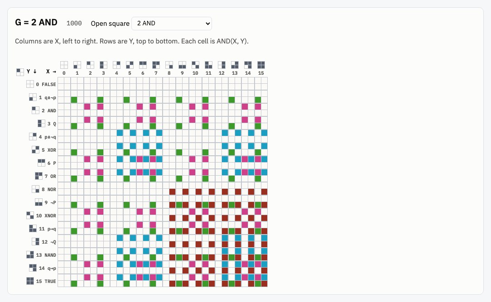

### Truth-table view and Venn colours

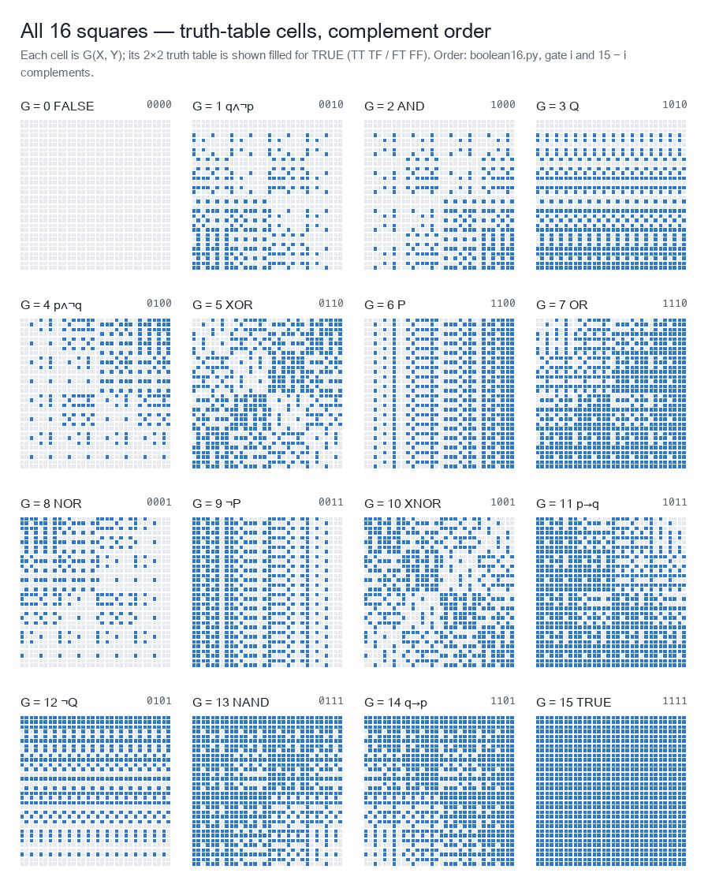

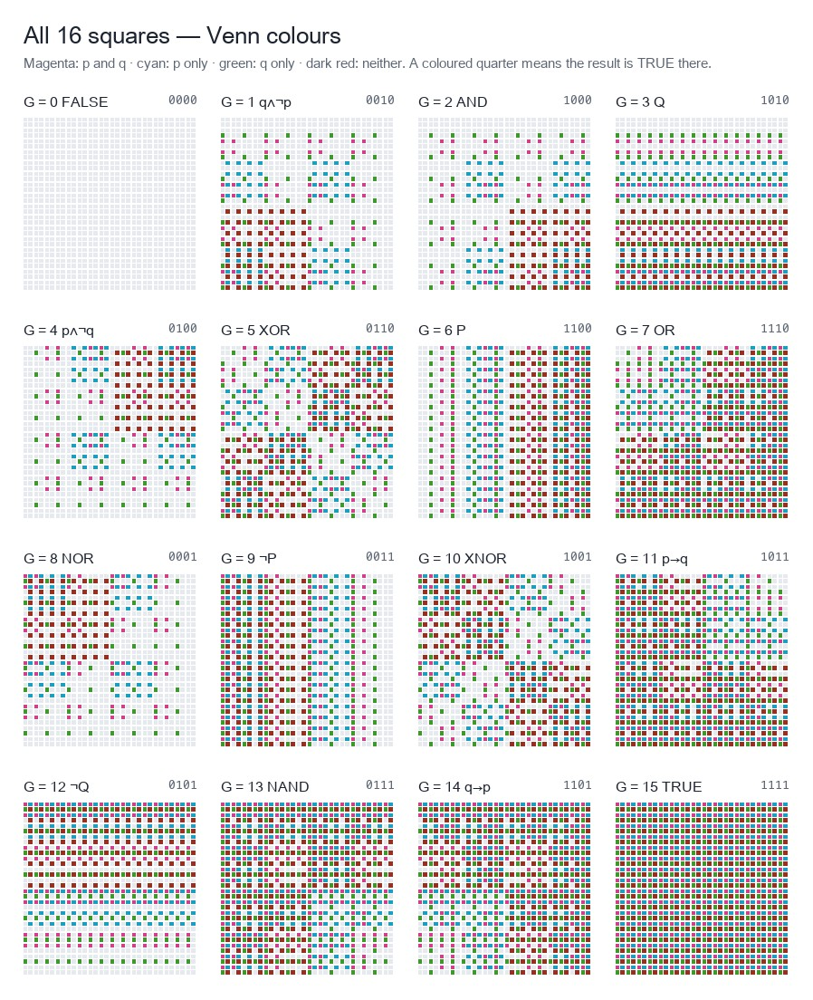

## Patterns

Each of these was checked across all cells before the page was built.

- **FALSE and TRUE** ignore their inputs: every cell is FALSE, or every cell is TRUE.
- **P copies X** (every column is one gate) and **Q copies Y** (every row is one gate). **NOT P gives 15 − X** and **NOT Q gives 15 − Y**, the complement of the input.
- **AND, OR, XOR, XNOR, NAND and NOR are symmetric**: G(X, Y) = G(Y, X), so their squares mirror across the diagonal.
- **On the diagonal** (X = Y), AND gives back X and XOR gives FALSE.
- **Complement squares:** the square for gate 15 − G is the square for G with every truth table flipped, cell for cell.

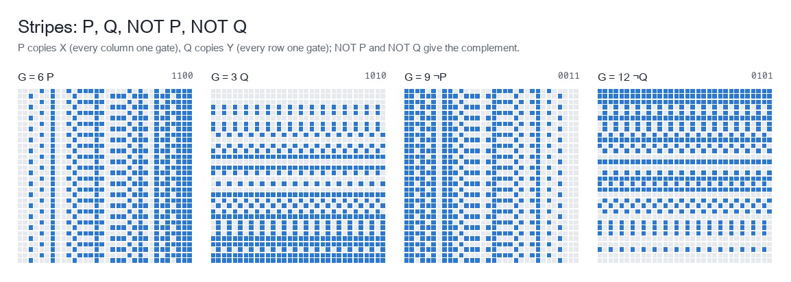

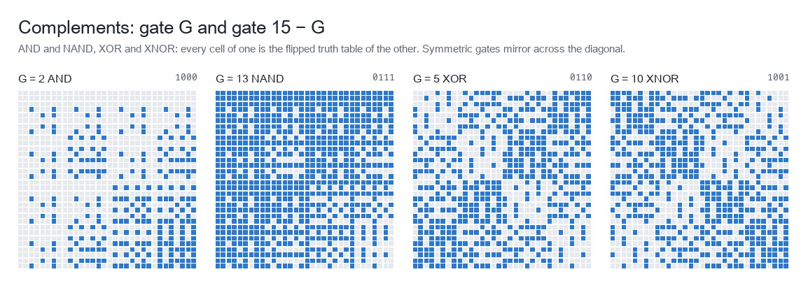

## Nested patterns: Sierpiński and *A New Kind of Science*

Sorting the axes by **truth-table value** (the truth table read as a binary number, 0000, 0001, 0010 … 1111) turns each square into G applied **bit by bit to two 4-bit numbers**, and nested, self-similar patterns appear.

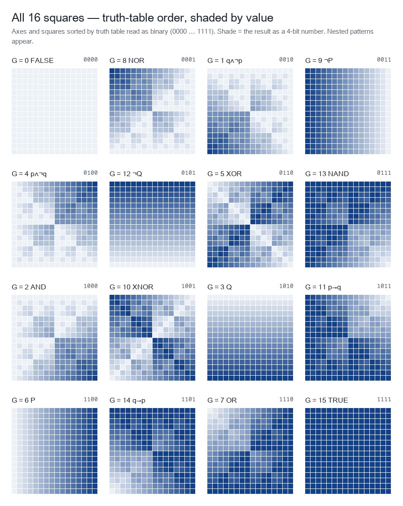

**AND** gives a Sierpiński-style triangle: the empty cells are exactly the pairs whose truth tables share no TRUE row (X AND Y = 0). On the right, the same rule on 6-bit numbers 0–63, computed bitwise (not from the gates), shows the pattern continuing at larger scale.

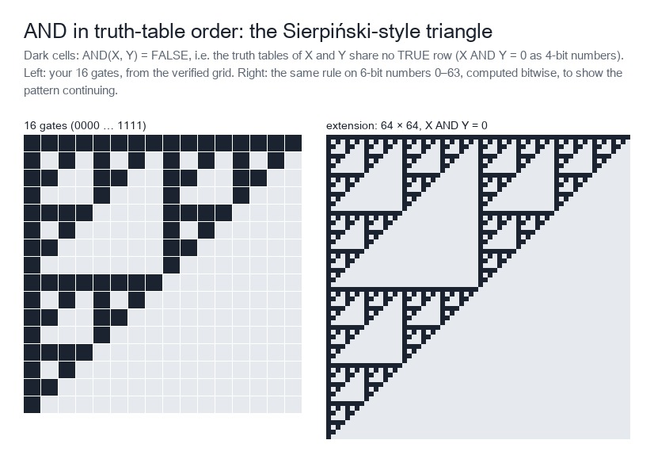

**XOR** is built from half-size copies of itself: four 8 × 8 blocks, each of four 4 × 4 blocks, and so on.

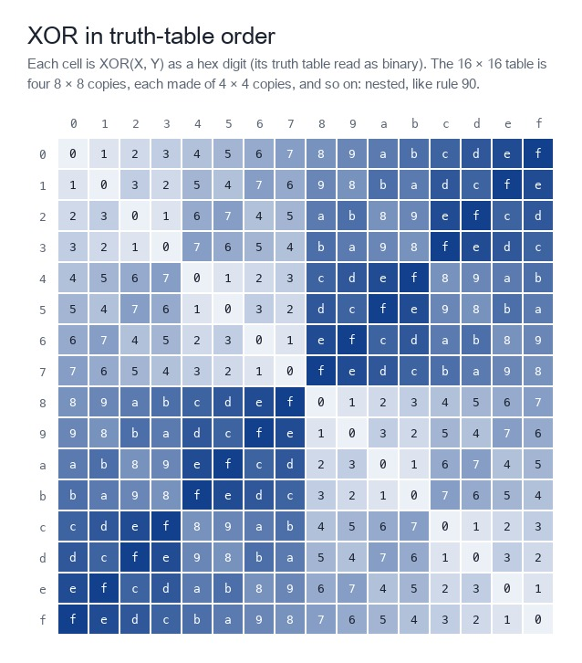

These are the patterns Stephen Wolfram's *A New Kind of Science* is full of. Its elementary cellular automata compute each new cell as a logic function of three cells above it, the three-input version of these 16 gates. Rule 90, where each cell is the XOR of its two neighbours, grows the Sierpiński triangle. Rules that just copy a neighbour give plain lines, like the P and Q stripes, and rules that ignore their inputs give uniform regions, like FALSE and TRUE.

One difference: these squares are **tables**, one operation applied to every pair, so they can show uniform, striped or nested patterns. Wolfram's most surprising pictures, such as rule 30's apparent randomness, come from running a rule over and over, feeding each row into the next, which a table never does.

- *A New Kind of Science*, online edition: <https://www.wolframscience.com/nks/>
- "How Do Simple Programs Behave?" (rule 90 and its nested pattern): <https://www.wolframscience.com/nks/p25--how-do-simple-programs-behave/>
- MathWorld, Rule 90: <https://mathworld.wolfram.com/Rule90.html>
- MathWorld, Sierpiński Sieve (Pascal's triangle mod 2, bitwise AND, rules 60, 90 and 102): <https://mathworld.wolfram.com/SierpinskiSieve.html>

## Four kinds of pattern

Looking across all 16 squares, every gate makes one of four kinds of pattern. Which one depends on how the gate uses its two inputs:

| Pattern | Gates | Why |
|---|---|---|
| Blank or solid | FALSE, TRUE | the output ignores both inputs |
| Stripes | P, Q, NOT P, NOT Q | the output follows one input |
| Triangles (Sierpiński-style) | the eight gates with one or three TRUE rows: AND, OR, NAND, NOR, p∧¬q, q∧¬p, p→q, q→p | each is AND with its inputs and/or output flipped, so each square is AND's triangle reflected or inverted |
| **Checkerboards** | **XOR, XNOR** | the output compares the two inputs: same or different |

### Checkerboards: XOR and XNOR

XOR's square is the hardest to read, because its pattern is spread across the four quarters of the cells. Take one quarter (one truth-table row) at a time. X's values run in stripes down the columns and Y's values in stripes across the rows, and XOR is TRUE where a TRUE stripe crosses a FALSE one. Crossing stripes that way makes a **checkerboard**. In truth-table order the four quarters are checkerboards of four sizes, with squares 8, 4, 2 and 1 cells wide. The whole square is those four laid on top of each other. XNOR is the same with TRUE and FALSE swapped.

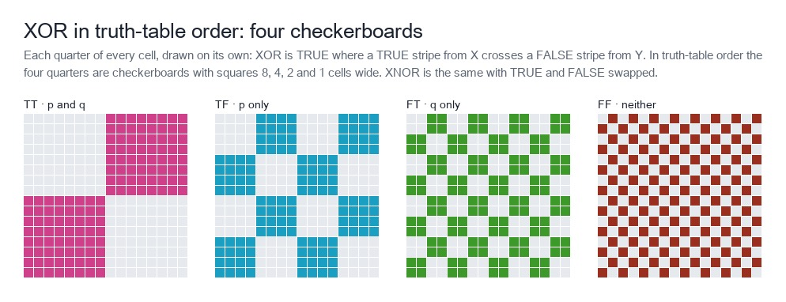

In the default complement order the rows and columns are shuffled, so the same crossing makes an irregular plaid instead of a clean checkerboard. That is why it's hard to see there.

Two more properties set XOR and XNOR apart:
- **Latin squares:** every row and every column contains all 16 gates exactly once, like a row of a Sudoku. No other square does this. XOR's square is the addition table of 4-bit numbers where 1 + 1 = 0.
- **A constant diagonal:** anything XOR itself is FALSE, so XOR's diagonal is all FALSE and XNOR's all TRUE.

All of these (the Latin squares, the diagonals, the four checkerboards, and the triangle family being exactly those eight gates) are checked by `tools/gates.js` on every build. The triangle-family check also confirms that the other eight gates fail the same test.

### One quarter at a time, all 16 squares

The same view as the page's **One quarter** option, for every square: each figure shows a single truth-table row of every cell, in that region's Venn colour, in truth-table order. Within one quarter the four kinds of pattern are at their simplest:

- **FALSE, TRUE:** blank or solid.
- **P, Q, NOT P, NOT Q:** stripes.
- **AND, NOR, p∧¬q, q∧¬p** (one TRUE row): one block in four is lit. **OR, NAND, p→q, q→p** (three TRUE rows): three blocks in four.
- **XOR, XNOR:** checkerboards.

The blocks are 8 cells wide in the TT quarter, then 4, 2 and 1. Stacking the four quarters, each at its own scale, is what builds the patterns in the full squares: AND's four block patterns stack into the Sierpiński-style triangle, and XOR's four checkerboards stack into its nested table.

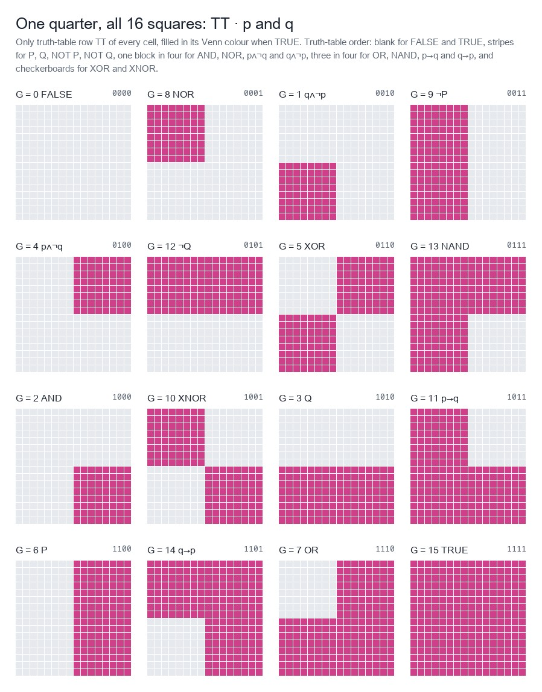

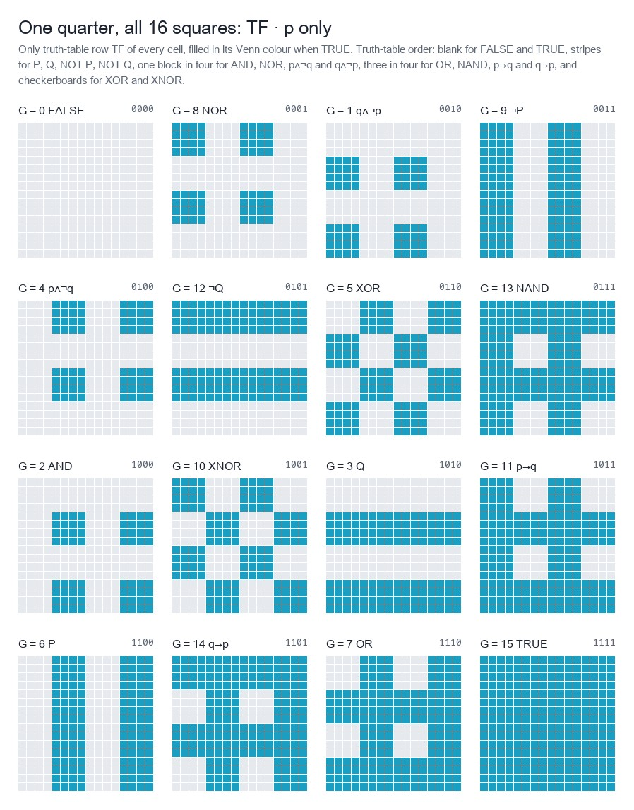

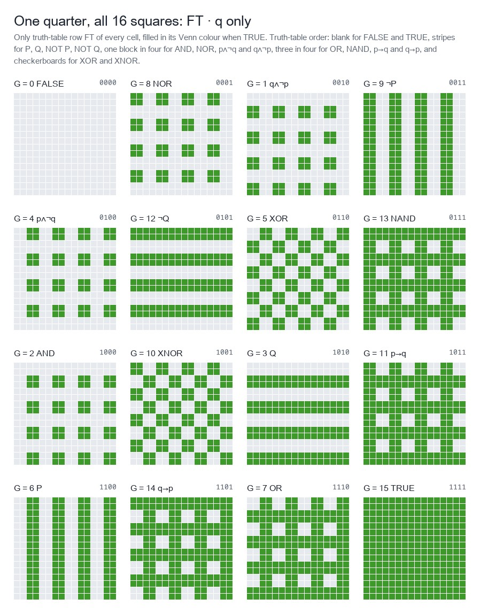

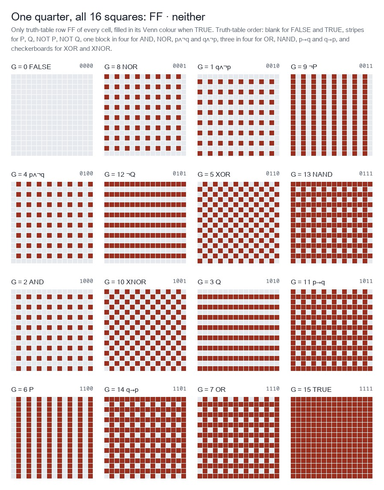

Every cell in these figures was checked while drawing: quarter k of G(X, Y) must equal G applied to row k of X and row k of Y.

## The 506 programs

Each cell is itself a lambda term. Reducing all 4,096 cell terms gives **506 different normal forms**, and each one behaves exactly like one of the 16 gates:

| Level | How many |
|---|---|
| Cell terms as written | 4,096 |
| Normal forms (different programs) | 506 |
| Behaviours (the gates) | 16 |

For each gate, exactly one program is its term in `lambda16.txt`. **2,064 cells** reduce to one of those; the other 2,032 reduce to a longer program with the same truth table. Terms that are the same program are *β-equal*; programs that give the same answers are *extensionally equal*. The cells show 16 behaviours but 506 programs.

| Gate | Truth table | Programs | Cells | Its lambda16.txt program |
|---|---|---|---|---|
| 0 FALSE | 0000 | 63 | 680 | `λpqab.b` |
| 1 q AND NOT p | 0010 | 32 | 216 | `λpqab.p b (q a b)` |
| 2 AND | 1000 | 32 | 216 | `λpqab.p (q a b) b` |
| 3 Q | 1010 | 21 | 168 | `λpqab.q a b` |
| 4 p AND NOT q | 0100 | 32 | 216 | `λpqab.p (q b a) b` |
| 5 XOR | 0110 | 20 | 168 | `λpqab.p (q b a) (q a b)` |
| 6 P | 1100 | 21 | 168 | `λpqab.p a b` |
| 7 OR | 1110 | 32 | 216 | `λpqab.p a (q a b)` |
| 8 NOR | 0001 | 32 | 216 | `λpqab.p b (q b a)` |
| 9 NOT P | 0011 | 21 | 168 | `λpqab.p b a` |
| 10 XNOR | 1001 | 20 | 168 | `λpqab.p (q a b) (q b a)` |
| 11 IMPLIES (p -> q) | 1011 | 32 | 216 | `λpqab.p (q a b) a` |
| 12 NOT Q | 0101 | 21 | 168 | `λpqab.q b a` |
| 13 NAND | 0111 | 32 | 216 | `λpqab.p (q b a) a` |
| 14 CONVERSE (q -> p) | 1101 | 32 | 216 | `λpqab.p a (q b a)` |
| 15 TRUE | 1111 | 63 | 680 | `λpqab.a` |

Every one of the 506 programs is drawn as a Tromp diagram, written in eight notations (lambda short and long form, de Bruijn, Tromp binary, Polish, reverse Polish, SKI combinators and JavaScript) and mapped back to the cells it comes from (all 16 squares, coloured by a chosen quarter) in [`page/programs-506.html`](page/programs-506.html), also online as [The 506 programs](https://claude.ai/artifact/WvgZEadpag2UVS7NeEr46d) (a private claude.ai page until shared). Each notation was checked: the text forms read back to the same term, and the lambda, SKI and JavaScript versions all reproduce the truth table.

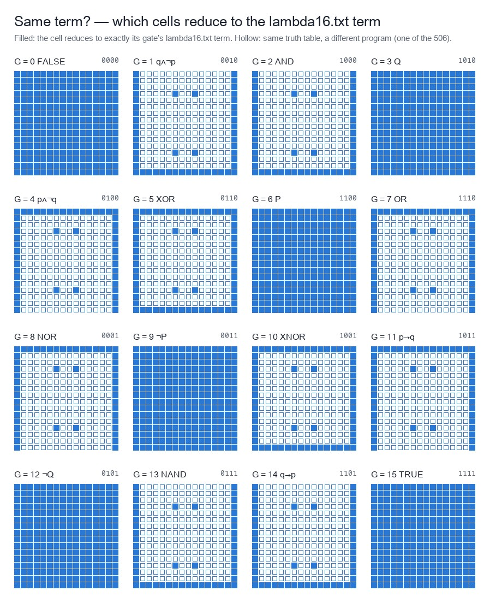

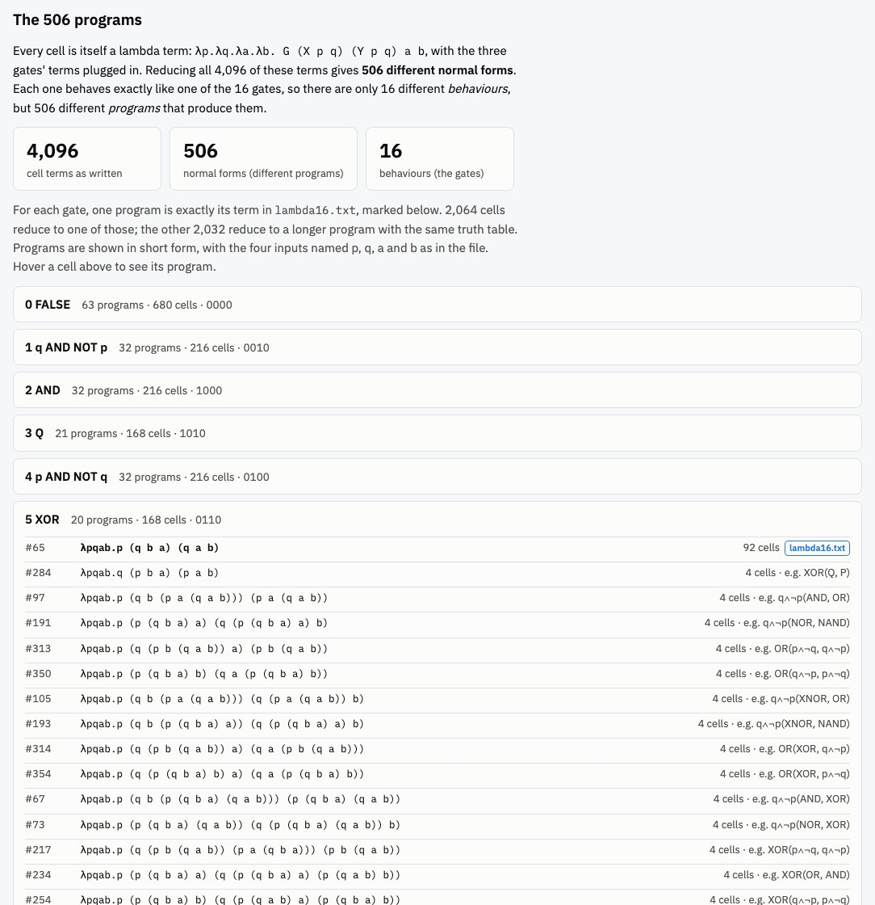

## Files

| Path | What it is |
|---|---|
| `gates-of-gates.html` | everything below in one self-contained document (open it in any browser, works offline) |
| `images/` | the poster photo, the figures above, and two screenshots of the page |
| `data/cells.csv` | all 4,096 cells: G, X, Y, the result, and which of the 506 programs it reduces to |
| `data/programs.csv` | the 506 programs: behaviour, number of cells, whether it is the lambda16.txt term, short form, an example cell |
| `data/gates-data.json` | the same data as used by the page |
| `page/gates-of-gates.html` | a local copy of the interactive page |
| `page/programs-506.html` | all 506 programs, each as a Tromp diagram, in eight notations, with a map of the cells it comes from |
| `tools/` | the scripts that regenerate everything |

Truth-table columns in the CSV files start with an apostrophe (`'1000`) so spreadsheets keep the leading zeros.

To regenerate, from this folder:

```
node tools/gates.js                 # recompute every cell by lambda reduction; writes tools/gates.html and tools/gates-data.json
python3 tools/figures.py images     # redraw the figures from tools/gates-data.json
node tools/programs506.js           # rebuild the 506-programs page from tools/gates-data.json; writes tools/programs506.html
python3 tools/build_document.py PATH/TO/md2html.py   # rebuild gates-of-gates.html (md2html.py is in the lasermade-tools repository)
```

`gates.js` stops with an error if any cell, pattern or program count fails its check, and `programs506.js` stops if any notation fails its check.
